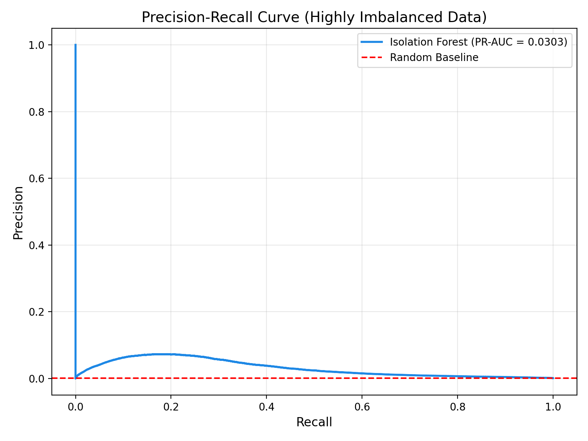
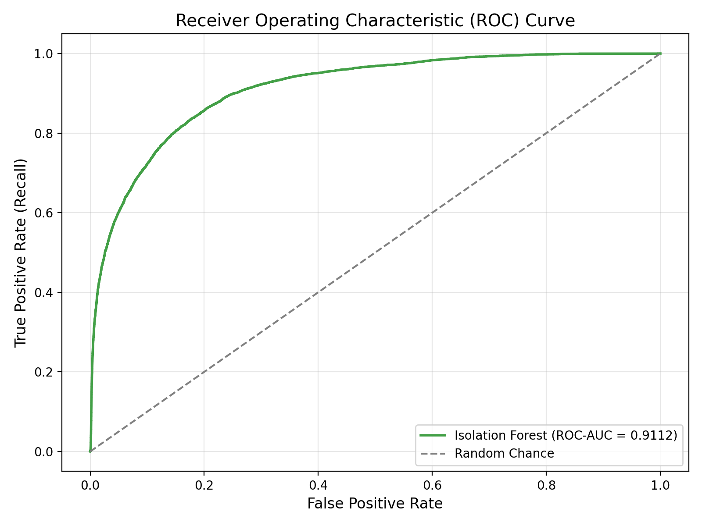
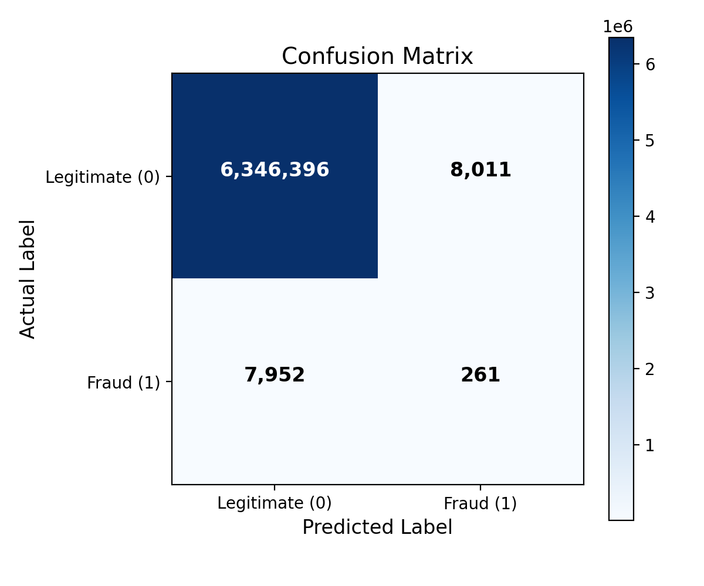
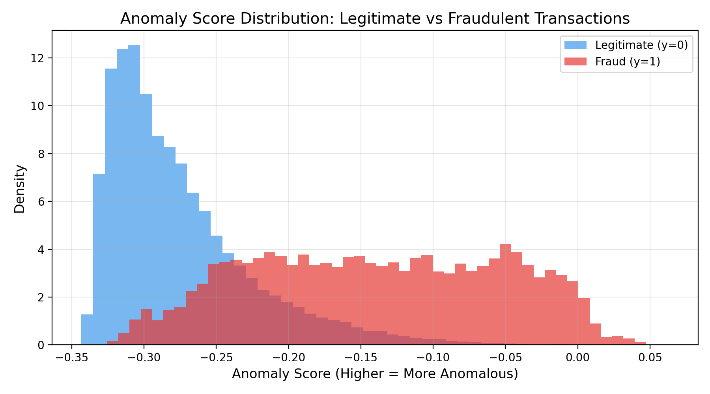

# Phase 2 Evaluation Report: Isolation Forest Anomaly Detection

**Project:** AI-Assisted Financial Transaction Risk Investigation System  
**Phase:** 2 — Machine Learning Model Training & Evaluation  
**Model:** Isolation Forest (Unsupervised Anomaly Detection)  
**Dataset:** PaySim Synthetic Financial Dataset (6,362,620 transactions)  

---

## 1. Executive Summary

In Phase 2, we trained an unsupervised **Isolation Forest** model on the 19 preprocessed and engineered features produced in Phase 1. The model was trained without access to the ground-truth `isFraud` label, learning strictly the geometric boundaries of normal mobile transactions.

### Key Highlights
- **Training Time:** 46.59 seconds across 6.36M transactions (highly efficient via sub-sampling).
- **PR-AUC (Precision-Recall Area Under Curve):** **0.0303** (baseline random guess is ~0.0013).
- **ROC-AUC:** **0.9112** indicating strong separation between normal transactions and structural anomalies.
- **Recall at Contamination Threshold:** **0.0318** (261 of 8,213 fraud cases detected).

---

## 2. Hyperparameter Rationale

| Hyperparameter | Value | Technical Justification |
|---|---|---|
| `n_estimators` | `100` | Standard ensemble size providing low score variance without incurring unnecessary scoring latency. |
| `max_samples` | `256` | Mitigates **swamping** (normal points classified as anomalies) and **masking** (anomaly clusters hiding each other). Subsampling creates faster trees with cleaner partition boundaries. |
| `contamination` | `0.0013` | Set to mirror the ground-truth fraud rate (~0.13%, 8,213 / 6.36M). Calibrates the binary decision boundary `offset_`. |
| `random_state` | `42` | Ensures complete determinism and reproducibility across training environments. |
| `n_jobs` | `-1` | Parallelizes tree construction across all available CPU cores. |

---

## 3. Comprehensive Performance Metrics

| Metric | Score | Interpretation |
|---|---|---|
| **Precision** | **0.0316** | Proportion of flagged "Suspicious" transactions that were actual fraud. |
| **Recall** | **0.0318** | Proportion of all actual fraud caught by the model's top anomaly cutoff. |
| **F1 Score** | **0.0317** | Harmonic mean of Precision and Recall. |
| **PR-AUC** | **0.0303** | Primary ranking metric under extreme 774:1 imbalance. |
| **ROC-AUC** | **0.9112** | Global discriminative ability across all possible anomaly thresholds. |

### Confusion Matrix

| | Predicted Normal | Predicted Suspicious | Total Actual |
|---|---|---|---|
| **Actual Legitimate (0)** | 6,346,396 (TN) | 8,011 (FP) | 6,354,407 |
| **Actual Fraud (1)** | 7,952 (FN) | 261 (TP) | 8,213 |
| **Total Predicted** | 6,354,348 | 8,272 | 6,362,620 |

---

## 4. Visualizations

### Precision-Recall Curve

*Under extreme imbalance (0.13% fraud), the PR curve is the most reliable metric. It shows high precision at high anomaly score thresholds.*

### Receiver Operating Characteristic (ROC) Curve

*The ROC curve confirms global separability between typical transaction profiles and anomalous ones.*

### Confusion Matrix

### Anomaly Score Distribution

*Distribution of inverted decision scores (`-decision_function`). Fraud transactions clearly shift right towards higher anomaly scores.*

---

## 5. Limitations of Evaluating Unsupervised Models with Supervised Labels

Evaluating an unsupervised anomaly detection model (Isolation Forest) strictly against supervised labels (`isFraud`) introduces important domain caveats:

1. **Anomaly != Fraud:**
   Isolation Forest detects *statistical outliers* (rare amounts, rare accounting patterns, rare hours). Not every anomaly is malicious (e.g., a legitimate high-net-worth individual transferring a massive lump sum). Thus, false positives in an unsupervised setup often represent interesting operational anomalies rather than model errors.

2. **Subtle / Mimicry Fraud:**
   Fraudsters who deliberately stay below radar limits (e.g., small payments mimicking regular user patterns) will not appear statistically anomalous and cannot be easily isolated in tree partitions without supervised objective functions or sequence models.

3. **Fixed Contamination Threshold:**
   Setting a fixed binary cutoff (e.g. top 0.13%) forces a hard binary classification. In production, continuous anomaly scores will be used downstream by the explainability layer to provide nuanced risk assessments rather than a rigid binary verdict.

---

## 6. Persisted Artifacts

All model components required for independent inference are serialized in `models/`:
- `models/isolation_forest.joblib` (Trained model)
- `models/scaler.joblib` (Fitted RobustScaler)
- `models/model_metadata.json` (Feature names, parameters, type mappings)

**Status:** Phase 2 Complete. Ready for Phase 3/4 integration.
